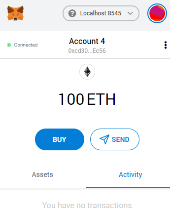

# Profit Splitter with Solidity Contracts

This repository, contains three solidity contracts. Each contract splits a company's earnings in three different ways. The first contract, Associate Profit Splitter, splits profits evenly among associate level employees. The second contract, Tiered Profit Splitter, distributes profits among different employee tiers. For example, the CEO gets 60%, CTO 25%, and the remaining 15% goes to lower tier employees. Last is the deferred equity plan, this contract allows for shares of a company to be distributed evenly throughout a period of time. For example, if a company requires that 1000 shares be distributed throughout a vesting period of 4 years, this contract will provide the necessary requirements to release the funds after each year the employee remains with the company. Lets take a closer look at each contract.

## Preliminary Steps For Deploting The Contracts
First, open the Remix web page  and link it to the Metamask  chrome plug in. On the Metamask plugin window,  choose the network that will be used to send transaction. Considering this is a testing demonstration of the contract's functionalities, Gnache  was used to set up a test network on the local machine; therefore, Metamask's network was set to localhost 8545 as seen on the image below. Lastly, set the account on the Metamask where funds will be transfering from. In the image below, the account is shown as account 4. It will be different depending on the number of wallets HR Department has saved on their Metamask account.

## Associate Profit Splitter

Once Metamask and solidity are connected to the local network, import the AssociateProfitSplitter.sol contract. Compile it and then navigate to the "Deploy & Run Transactions" icon located on the left hand side of Remix and set the dropdowns like the ones shown below. In the deploy section, fill in the three addresses of three employees that will receive an evenly distributed amount from a total amount set by Human Resources department. Click transact and find that the contracts have been successfully deployed. Be advised that everytime a contract is deployed a gas fee of .002 ETH is spent. This amount is equivalent to $0.85 (calculated using 1 ETH at $425). 

Once deployed, fill in the value to be distributed and click deposit. In this test run 15 ETH were depositted; therefore, each employee should receive 5 ETH each.

Note that the first account was deducted 15.002 ETH due to the gas spent when deploying the contract. The rest of the recipient employee accounts indeed received 5 ETH each as shown below.

## Tierred Profit Splitter

