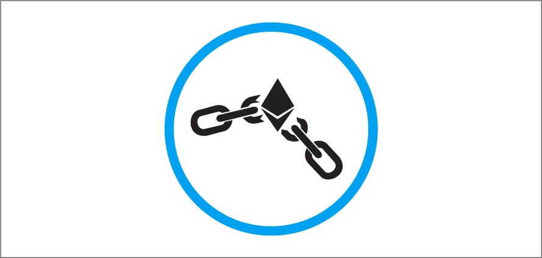
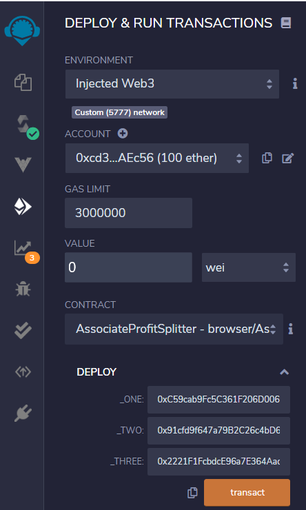
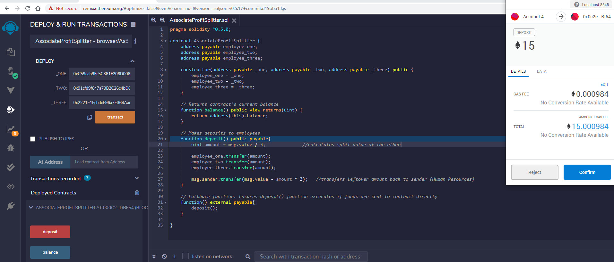
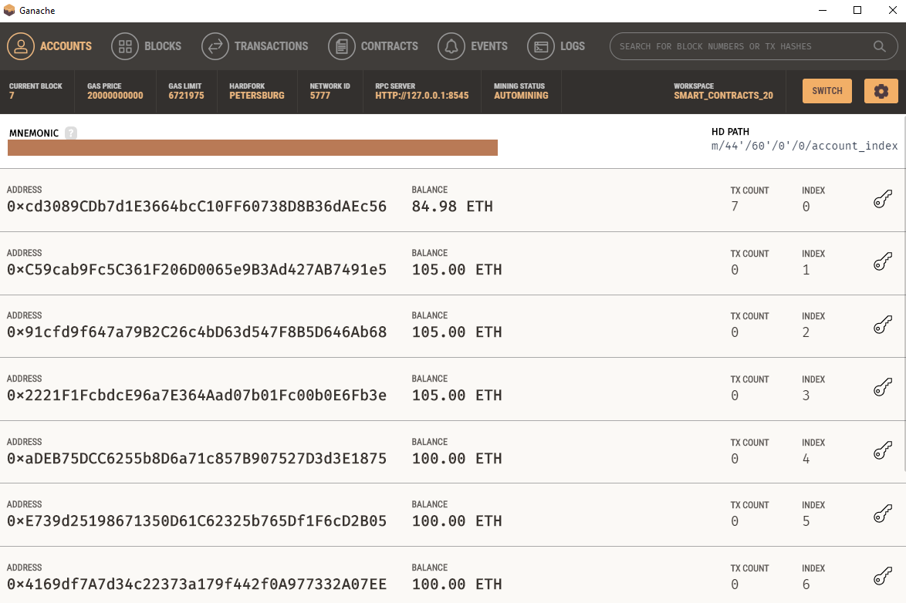
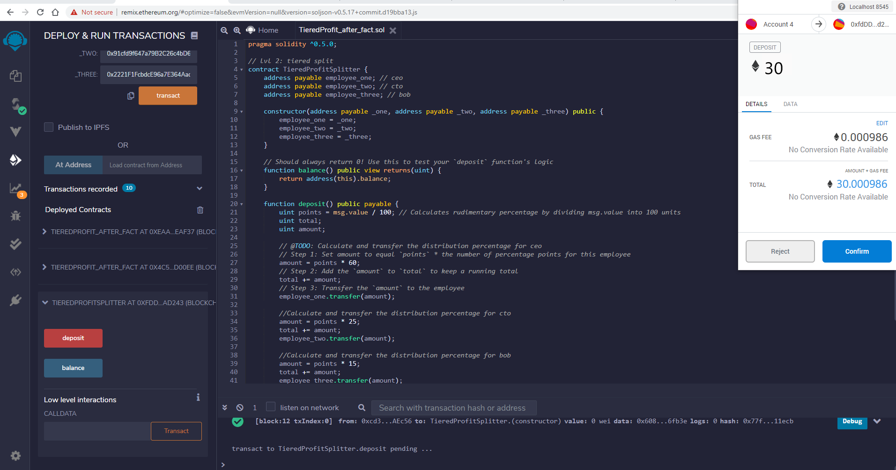
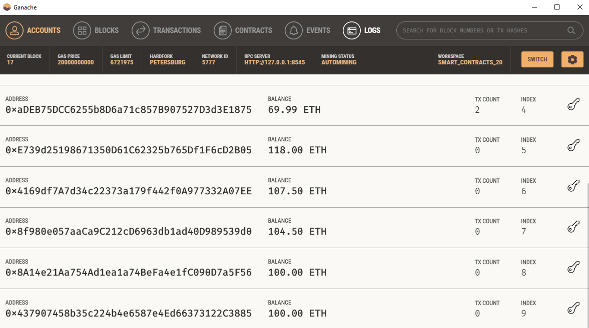
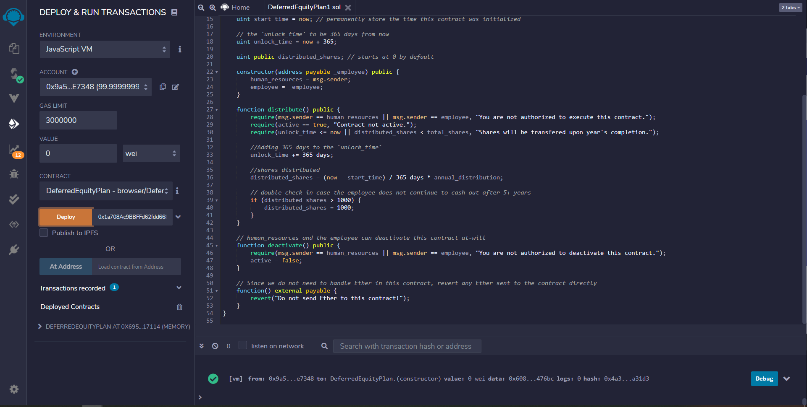

# Profit Splitter with Solidity Contracts

This repository contains three solidity contracts. Each contract splits a company's earnings differently. The first contract, Associate Profit Splitter, splits profits evenly among associate level employees. Every employee receives the same amount.

The second contract, Tiered Profit Splitter, distributes profits among different employee tiers. For example, the CEO gets 60%, CTO 25%, and the remaining 15% goes to lower tier employees. 

The third contract is the deferred equity plan. This contract allows for the shares of a company to be distributed evenly throughout a period of time. For example, if a company requires that 1000 shares be distributed throughout a vesting period of 4 years, this contract will distribute the funds after each year the employee remains with the company. Let's take a closer look at each contract and how they're deployed on the ethereum network.

[Click Here to view the raw code for the Solidity Contracts](https://github.com/EmilianoAmador/ProfitSplitter_Blockchain-Solidity-Contracts/tree/master/Contracts)

### Preliminary Steps For Deploying The Contracts
First, open the Remix web page  and link it to the Metamask  chrome plug in. On the Metamask plugin window,  choose the network that will be used to send transactions. Considering this is a testing demonstration of the contract's functionalities, Ganache  was used to set up a test network on the local machine; therefore, Metamask's network was set to localhost 8545 as seen on the image below. Lastly, set the account on the Metamask where funds will be transferring from. In the image below, the account is shown as account 4. It will be different depending on the number of wallets HR Department has saved on their Metamask account.

### Associate Profit Splitter
This contract was designed to split a set amount of funds evenly among three associate level employees. To use, follow the instructions below:

Once Metamask and Solidity are connected to the local network, import the AssociateProfitSplitter.sol contract to Remix. Compile it and then navigate to the "Deploy & Run Transactions" icon located on the left hand side of the page. Set the dropdowns like the ones shown below. In the deploy section, fill in the three addresses of three employees that will receive an evenly distributed amount from a total amount set by the Human Resources department. Click transact and find that the contracts will be successfully deployed. Be advised that everytime a contract is deployed a gas fee of .002 ETH is spent. This amount is equivalent to $0.85 (calculated using 1 ETH equal to $425). 

Once deployed, fill in the value to be distributed and click deposit. In this test run 15 ETH were deposited; therefore, each employee should receive 5 ETH each.

Note that the first account was deducted 15.002 ETH due to the gas spent when deploying the contract. The rest of the recipient employee accounts indeed received 5 ETH each as shown below.

Lastly, the balance button should always equal zero. This is due to the contract's code ensuring that all the funds get sent out. This button is necessary to verify that there aren't any ETH held in the solidity contract. 

### Tiered Profit Splitter

For this contract, the concept is the same as the previous where a set amount is split into three parts. The only difference is that this contract will divide the set amount into three different percentages. This feature allows for the funds to be distrubted among three different employees working within three different departments or in this case, tiers. The CEO will receive %60, the CTO will receive %25, and a lower tier associates receive 15% of a set amount:

For this test run, the contract was deployed the same way as the one above. The amount to be distributed was set to 30 ETH; therefore, the CEO should receive 18 ETH, the CTO 7.50 ETH, and the lower level associate 4.50 ETH.

### Deferred Equity Plan

This contract follows the same principles of splitting a set amount of funds into multiple parts; however, unlike the other contracts this contract facilitates a split of a set amount among different time periods to an employee. In this example we used a set amount of 1000 ETH to be split evenly along a vesting period of 4 years. More specifically, the employee will receive 250 ETH every year he/she completes with the company until he/she reaches the end of the vesting period.

